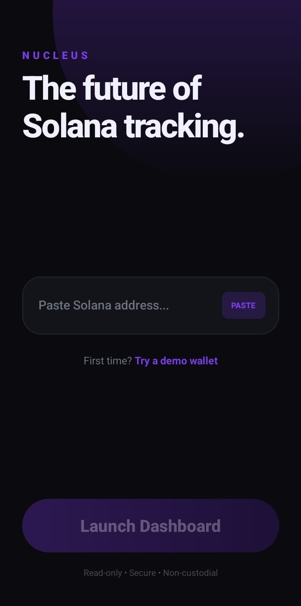
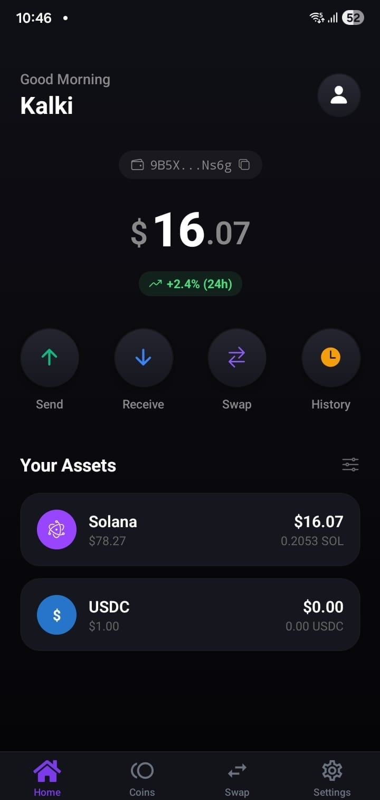
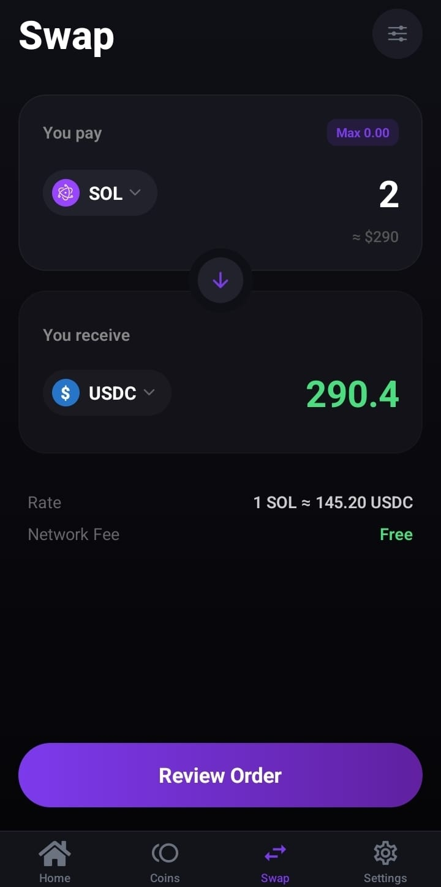
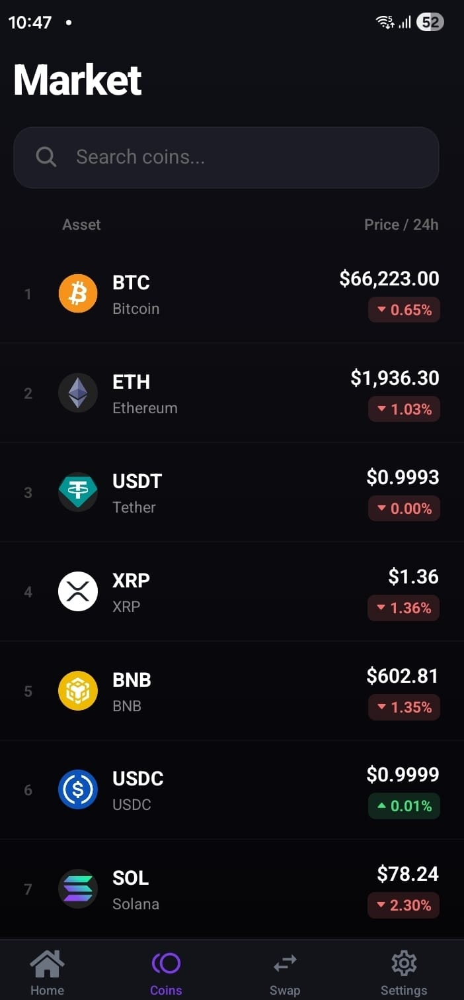
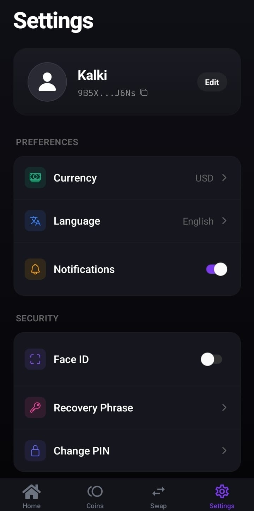

# <h1 style="color: #7C3AED; font-weight: bold;" align="center">Nucleus</h1>

### _Your Solana Command Center_

Redefining crypto portfolio management on Solana. A modern, secure, and intuitive mobile wallet built with React Native and TypeScript.

[](https://reactnative.dev/)
[](https://expo.dev/)
[](https://www.typescriptlang.org/)
[](https://solana.com/)

**[Features](#core-features) • [Screenshots](#visual-journey) • [Installation](#quick-start) • [Tech Stack](#tech-stack)**

---

## Screenshots

### 🚀 Onboarding
<p align="center">
  
</p>

### 💼 Portfolio Dashboard
<p align="center">
  
</p>

### 🔄 Token Swap
<p align="center">
  
</p>

### 📊 Market Watch
<p align="center">
  
</p>

### ⚙️ Settings
<p align="center">
  
</p>

---

## Features

### 🎯 Portfolio Management
Track your entire Solana portfolio in one unified dashboard. Real-time balance updates, 24-hour performance metrics, and instant USD conversion for all your SOL and SPL tokens.

### 🔄 Token Swap
Seamless token swaps powered by Solana's lightning-fast network. Exchange tokens with real-time rates and zero network fees. Simple, intuitive interface for instant token exchanges.

### 📈 Market Intelligence
Stay ahead with live cryptocurrency prices. Browse top tokens including BTC, ETH, SOL, and more. Powerful search functionality for quick access to any token's market data.

### 🔐 Security First
Non-custodial architecture means your keys never leave your device. Biometric authentication (Face ID/Touch ID) and encrypted PIN protection. Your crypto, your control.

### 🎨 Design Philosophy
**Minimalist** — Clean interfaces, zero clutter
**Intuitive** — Natural gestures, logical flows
**Fast** — Instant feedback, smooth 60fps animations
**Accessible** — Time-based greetings, readable typography

---

## Tech Stack

_Built with modern technologies_

```yaml
Frontend:
  framework: React Native 0.81.5
  platform: Expo ~54.0
  language: TypeScript 5.9
  routing: Expo Router 6.0

Animation:
  motion: Moti 0.30.0
  core: Reanimated 4.1.0
  gestures: React Native Gesture Handler

Blockchain:
  network: Solana
  library: "@solana/web3.js"
  rpc: Mainnet-beta

UI/UX:
  theme: Dark + Purple Accent (#7C3AED)
  gradients: expo-linear-gradient
  icons: "@expo/vector-icons"
  safe_area: react-native-safe-area-context
```

---

## Quick Start

### Installation

```bash
# Clone the repository
git clone https://github.com/VINODvoid/nucleus.git
cd nucleus

# Install dependencies
bun install  # or npm install

# Start the development server
bun start

# Run on specific platform
bun run ios      # 🍎 iOS
bun run android  # 🤖 Android
bun run web      # 🌐 Web
```

### Prerequisites
- Node.js 18+
- Bun 1.0+ (or npm/yarn)

---

## Usage

### Getting Started

1. **Launch** — Open Nucleus on your device
2. **Connect** — Paste your Solana wallet address
3. **Explore** — View portfolio, swap tokens, track market
4. **Customize** — Adjust settings to your preference

**No wallet?** Tap "Try a demo wallet" to explore all features with zero commitment.

---

## Project Structure

```
nucleus/
│
├── app/                          # Expo Router architecture
│   ├── (tabs)/                   # Tab-based navigation
│   │   ├── index.tsx            # 🏠 Home dashboard
│   │   ├── coins.tsx            # 📊 Market prices
│   │   ├── swap.tsx             # 🔄 Token swap
│   │   └── settings.tsx         # ⚙️  User settings
│   ├── index.tsx                # 🚀 Onboarding screen
│   └── _layout.tsx              # 🎨 Root layout
│
├── components/                   # Reusable UI components
│   ├── Button.tsx               # Custom button component
│   ├── Card.tsx                 # Card wrapper
│   └── Input.tsx                # Text input field
│
├── constants/                    # App-wide constants
│   └── Colors.ts                # Color palette (#7C3AED)
│
├── assets/                       # Static resources
│   ├── images/                  # App icons & graphics
│   └── fonts/                   # Custom typography
│
└── screenshots/                  # Visual documentation
```

---

## Roadmap

_The journey continues_

<table>
<tr>
<td width="50%" valign="top">

### 🎯 **Phase 1: Foundation** ✅

- [x] Portfolio tracking
- [x] Real-time SOL balance
- [x] USD conversion
- [x] Token swap interface
- [x] Market price monitoring
- [x] Settings & preferences
- [x] Biometric security

</td>
<td width="50%" valign="top">

### 🚀 **Phase 2: Enhancement** 🔄

- [ ] SPL token portfolio
- [ ] Transaction history
- [ ] NFT gallery viewer
- [ ] Multi-wallet management
- [ ] Price alerts & notifications
- [ ] DeFi positions tracking
- [ ] Export to CSV

</td>
</tr>
<tr>
<td width="50%" valign="top">

### 🌟 **Phase 3: Advanced** 📅

- [ ] Staking rewards calculator
- [ ] Portfolio analytics & charts
- [ ] Custom token watchlists
- [ ] Advanced swap routing
- [ ] Hardware wallet support
- [ ] WalletConnect integration
- [ ] Cross-chain bridging

</td>
<td width="50%" valign="top">

### 🎨 **Phase 4: Polish** 💎

- [ ] Light theme option
- [ ] Multiple language support
- [ ] Widget support (iOS/Android)
- [ ] Apple Watch companion
- [ ] Custom notifications
- [ ] Social features
- [ ] Desktop companion app

</td>
</tr>
</table>

---

## Contributing

We welcome contributions from the community!

1. Fork the repository
2. Create a feature branch (`git checkout -b feature/amazing-feature`)
3. Make your changes
4. Test thoroughly on iOS and Android
5. Commit your changes (`git commit -m 'Add amazing feature'`)
6. Push to the branch (`git push origin feature/amazing-feature`)
7. Open a Pull Request

### Guidelines
- Follow TypeScript best practices
- Maintain immutability patterns
- Write descriptive commit messages
- Keep components under 400 lines
- Verify animations are smooth (60fps)
- Check accessibility features
- Ensure responsive layouts

---

## Security

- **Non-custodial** — Your keys, your crypto
- **Device-only storage** — Nothing stored on servers
- **View-only mode** — Private keys never requested or stored
- **Biometric auth** — Face ID, Touch ID, encrypted PIN
- **Open source** — Transparent and auditable

**Found a vulnerability?** Please email security@nucleus.app instead of opening a public issue.

---

## License

```
MIT License

Permission is hereby granted, free of charge, to any person obtaining a copy
of this software and associated documentation files (the "Software"), to deal
in the Software without restriction, including without limitation the rights
to use, copy, modify, merge, publish, distribute, sublicense, and/or sell
copies of the Software.

THE SOFTWARE IS PROVIDED "AS IS", WITHOUT WARRANTY OF ANY KIND.
```

See [LICENSE](LICENSE) for full details.

---

## Acknowledgments

Built with amazing open-source technologies:

- **React Native** — Cross-platform mobile framework
- **Expo** — Development platform and tooling
- **Solana** — High-performance blockchain network
- **TypeScript** — Type-safe JavaScript
- **Moti** — Declarative animations
- **Reanimated** — Smooth 60fps animations

---

---

<div align="center">

### Made with 💜 by Kalki

**⭐ Star this repo if Nucleus powers your Solana journey**

[](https://github.com/VINODvoid/nucleus/stargazers)
[](https://github.com/VINODvoid/nucleus/network/members)
[](https://github.com/VINODvoid/nucleus/issues)

**[Report Bug](https://github.com/VINODvoid/nucleus/issues) • [Request Feature](https://github.com/VINODvoid/nucleus/issues) • [Join Discord](https://discord.gg/nucleus)**

---

*Built during the Solana Renaissance • Powered by caffeine and determination ☕*

</div>
