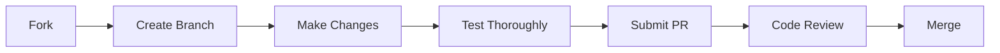

<div align="center">


# `N U C L E U S`

### *Your Solana Command Center*

<br/>

```typescript
const nucleus = {
  mission: "Redefining crypto portfolio management",
  vision: "Making Solana accessible to everyone",
  status: "Building the future ⚡"
}
```

<br/>

[](https://reactnative.dev/)
[](https://expo.dev/)
[](https://www.typescriptlang.org/)
[](https://solana.com/)

<br/>

**[Features](#-core-features) • [Screenshots](#-visual-journey) • [Installation](#-quick-start) • [Tech Stack](#-tech-stack)**

</div>

---

<div align="center">

## `> VISUAL JOURNEY_`

*Experience Nucleus in action*

</div>

<table>
  <tr>
    <td align="center" width="33%">
      
      <br/>
      <sub><b>🚀 Welcome Aboard</b></sub>
      <br/>
      <sub>Seamless onboarding experience</sub>
    </td>
    <td align="center" width="33%">
      
      <br/>
      <sub><b>💼 Portfolio Hub</b></sub>
      <br/>
      <sub>Real-time asset tracking</sub>
    </td>
    <td align="center" width="33%">
      
      <br/>
      <sub><b>🔄 Token Swap</b></sub>
      <br/>
      <sub>Instant token exchanges</sub>
    </td>
  </tr>
  <tr>
    <td align="center" width="33%">
      
      <br/>
      <sub><b>📊 Market Watch</b></sub>
      <br/>
      <sub>Live crypto prices</sub>
    </td>
    <td align="center" width="33%">
      
      <br/>
      <sub><b>⚙️ Control Center</b></sub>
      <br/>
      <sub>Personalized preferences</sub>
    </td>
    <td align="center" width="33%">
      <br/><br/>
      <h3>✨</h3>
      <sub><b>More Coming Soon</b></sub>
      <br/>
      <sub>The future is bright</sub>
    </td>
  </tr>
</table>

---

<div align="center">

## `> CORE FEATURES_`

</div>

<table>
<tr>
<td width="50%" valign="top">

### 🎯 **Portfolio Management**

```python
portfolio = {
  "real_time_balance": True,
  "multi_token_support": ["SOL", "USDC", "SPL_tokens"],
  "usd_conversion": "instant",
  "24h_performance": "+2.4%"
}
```

Track your entire Solana portfolio in one unified dashboard. Real-time balance updates, 24-hour performance metrics, and instant USD conversion.

</td>
<td width="50%" valign="top">

### 🔄 **Token Swap**

```javascript
const swap = {
  from: "SOL",
  to: "USDC",
  rate: "1 SOL ≈ 145.20 USDC",
  networkFee: "Free"
}
```

Seamless token swaps powered by Solana's lightning-fast network. Exchange tokens with real-time rates and zero network fees.

</td>
</tr>
<tr>
<td width="50%" valign="top">

### 📈 **Market Intelligence**

```go
type Market struct {
    Assets     []Crypto
    Prices     RealTime
    Changes24h Percentage
    Search     Enabled
}
```

Stay ahead with live cryptocurrency prices. Browse top tokens including BTC, ETH, SOL, and more. Search functionality for quick access.

</td>
<td width="50%" valign="top">

### 🔐 **Security First**

```rust
struct Security {
    mode: ViewOnly,
    keys: NeverStored,
    face_id: Biometric,
    pin: Encrypted,
    recovery: SecurePhrase
}
```

Non-custodial architecture. Your keys never leave your device. Biometric authentication and encrypted PIN protection.

</td>
</tr>
</table>

<div align="center">

### 🎨 **Design Philosophy**

| Principle | Implementation |
|:---------:|:--------------:|
| **Minimalist** | Clean interfaces, zero clutter |
| **Intuitive** | Natural gestures, logical flows |
| **Fast** | Instant feedback, smooth 60fps |
| **Accessible** | Time-based greetings, readable typography |

</div>

---

<div align="center">

## `> TECH STACK_`

*Built with modern technologies*

</div>

```yaml
Frontend:
  framework: React Native 0.81.5
  platform: Expo ~54.0
  language: TypeScript 5.9
  routing: Expo Router 6.0

Animation:
  motion: Moti 0.30.0
  core: Reanimated 4.1.0
  gestures: React Native Gesture Handler

Blockchain:
  network: Solana
  library: "@solana/web3.js"
  rpc: Mainnet-beta

UI/UX:
  theme: Dark + Purple Accent (#7C3AED)
  gradients: expo-linear-gradient
  icons: "@expo/vector-icons"
  safe_area: react-native-safe-area-context
```

---

<div align="center">

## `> QUICK START_`

</div>

### Prerequisites

```bash
node --version  # v18+
bun --version   # v1.0+ (or npm)
```

### Installation

```bash
# Clone the nucleus
git clone https://github.com/VINODvoid/nucleus.git

# Enter the core
cd nucleus

# Install dependencies (choose one)
bun install
# or
npm install

# Launch the reactor
bun start
```

### Platform-Specific Commands

<table>
<tr>
<td width="33%" align="center">

**🍎 iOS**
```bash
bun run ios
```

</td>
<td width="33%" align="center">

**🤖 Android**
```bash
bun run android
```

</td>
<td width="33%" align="center">

**🌐 Web**
```bash
bun run web
```

</td>
</tr>
</table>

---

<div align="center">

## `> USAGE_`

</div>

### Getting Started

<table>
<tr>
<td width="25%">

**1️⃣ Launch**

Open Nucleus on your device

</td>
<td width="25%">

**2️⃣ Connect**

Paste your Solana wallet address

</td>
<td width="25%">

**3️⃣ Explore**

View portfolio, swap tokens, track market

</td>
<td width="25%">

**4️⃣ Customize**

Adjust settings to your preference

</td>
</tr>
</table>

### Demo Mode

```bash
No wallet? No problem!
┌─────────────────────────────────┐
│  Tap "Try a demo wallet"        │
│  Explore all features           │
│  Zero commitment required       │
└─────────────────────────────────┘
```

---

<div align="center">

## `> PROJECT STRUCTURE_`

</div>

```
nucleus/
│
├── app/                          # Expo Router architecture
│   ├── (tabs)/                   # Tab-based navigation
│   │   ├── index.tsx            # 🏠 Home dashboard
│   │   ├── coins.tsx            # 📊 Market prices
│   │   ├── swap.tsx             # 🔄 Token swap
│   │   └── settings.tsx         # ⚙️  User settings
│   ├── index.tsx                # 🚀 Onboarding screen
│   └── _layout.tsx              # 🎨 Root layout
│
├── components/                   # Reusable UI components
│   ├── Button.tsx               # Custom button component
│   ├── Card.tsx                 # Card wrapper
│   └── Input.tsx                # Text input field
│
├── constants/                    # App-wide constants
│   └── Colors.ts                # Color palette (#7C3AED)
│
├── assets/                       # Static resources
│   ├── images/                  # App icons & graphics
│   └── fonts/                   # Custom typography
│
└── screenshots/                  # Visual documentation
```

---

<div align="center">

## `> ROADMAP_`

*The journey continues*

</div>

<table>
<tr>
<td width="50%" valign="top">

### 🎯 **Phase 1: Foundation** ✅

- [x] Portfolio tracking
- [x] Real-time SOL balance
- [x] USD conversion
- [x] Token swap interface
- [x] Market price monitoring
- [x] Settings & preferences
- [x] Biometric security

</td>
<td width="50%" valign="top">

### 🚀 **Phase 2: Enhancement** 🔄

- [ ] SPL token portfolio
- [ ] Transaction history
- [ ] NFT gallery viewer
- [ ] Multi-wallet management
- [ ] Price alerts & notifications
- [ ] DeFi positions tracking
- [ ] Export to CSV

</td>
</tr>
<tr>
<td width="50%" valign="top">

### 🌟 **Phase 3: Advanced** 📅

- [ ] Staking rewards calculator
- [ ] Portfolio analytics & charts
- [ ] Custom token watchlists
- [ ] Advanced swap routing
- [ ] Hardware wallet support
- [ ] WalletConnect integration
- [ ] Cross-chain bridging

</td>
<td width="50%" valign="top">

### 🎨 **Phase 4: Polish** 💎

- [ ] Light theme option
- [ ] Multiple language support
- [ ] Widget support (iOS/Android)
- [ ] Apple Watch companion
- [ ] Custom notifications
- [ ] Social features
- [ ] Desktop companion app

</td>
</tr>
</table>

---

<div align="center">

## `> CONTRIBUTING_`

</div>

We welcome contributions from the community! Here's how you can help:



### Development Guidelines

<table>
<tr>
<td width="50%">

**Code Quality**
- ✅ Follow TypeScript best practices
- ✅ Maintain immutability patterns
- ✅ Write descriptive commit messages
- ✅ Keep components under 400 lines

</td>
<td width="50%">

**Testing Requirements**
- ✅ Test on iOS and Android
- ✅ Verify animations are smooth
- ✅ Check accessibility features
- ✅ Ensure responsive layouts

</td>
</tr>
</table>

---

<div align="center">

## `> SECURITY_`

</div>

```typescript
const securityModel = {
  architecture: "Non-custodial",
  dataStorage: "Device-only",
  privateKeys: "Never requested or stored",
  viewMode: "Read-only access",
  authentication: ["Face ID", "Encrypted PIN", "Recovery Phrase"],
  openSource: true
}
```

**Found a vulnerability?** Please email security@nucleus.app instead of opening a public issue.

---

<div align="center">

## `> LICENSE_`

</div>

```
MIT License

Permission is hereby granted, free of charge, to any person obtaining a copy
of this software and associated documentation files (the "Software"), to deal
in the Software without restriction, including without limitation the rights
to use, copy, modify, merge, publish, distribute, sublicense, and/or sell
copies of the Software.

THE SOFTWARE IS PROVIDED "AS IS", WITHOUT WARRANTY OF ANY KIND.
```

See [LICENSE](LICENSE) for full details.

---

<div align="center">

## `> ACKNOWLEDGMENTS_`

</div>

<table>
<tr>
<td align="center" width="25%">

<br/>
<b>React Native</b>
<br/>
<sub>UI Framework</sub>
</td>
<td align="center" width="25%">

<br/>
<b>Expo</b>
<br/>
<sub>Development Platform</sub>
</td>
<td align="center" width="25%">

<br/>
<b>Solana</b>
<br/>
<sub>Blockchain Network</sub>
</td>
<td align="center" width="25%">

<br/>
<b>TypeScript</b>
<br/>
<sub>Type Safety</sub>
</td>
</tr>
</table>

---

<div align="center">

<br/>

### `Made with 💜 by Kalki`

<br/>

**⭐ Star this repo if Nucleus powers your Solana journey**

<br/>

[](https://github.com/VINODvoid/nucleus/stargazers)
[](https://github.com/VINODvoid/nucleus/network/members)
[](https://github.com/VINODvoid/nucleus/issues)

<br/>

**[Report Bug](https://github.com/VINODvoid/nucleus/issues) • [Request Feature](https://github.com/VINODvoid/nucleus/issues) • [Join Discord](https://discord.gg/nucleus)**

<br/>

---

<sub>Built during the Solana Renaissance • Powered by caffeine and determination ☕</sub>

<br/>

</div>
