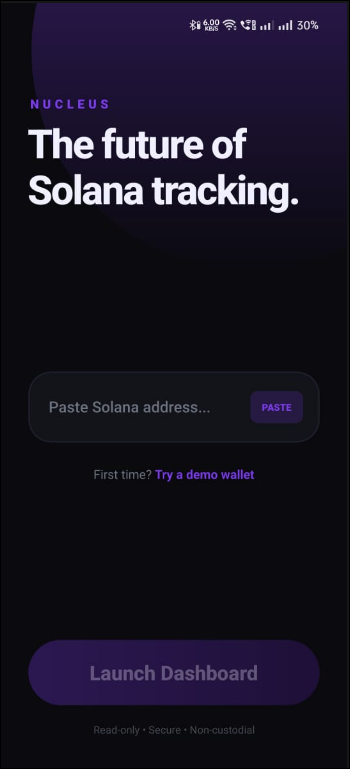

<div align="center">

# 🌌 NUCLEUS

### *The Future of Solana Tracking*

<p align="center">
  
  
  
  
</p>

**Track your Solana assets with style. Real-time portfolio monitoring in a sleek, modern interface.**

[Features](#-features) • [Screenshots](#-screenshots) • [Installation](#-installation) • [Usage](#-usage)

</div>

---

## 📸 Screenshots

<div align="center">

### Onboarding Experience

<table>
  <tr>
    <td align="center">
      
      <br />
      <sub><b>Track Your Solana Assets</b></sub>
    </td>
    <td align="center">
      
      <br />
      <sub><b>The Future of Solana Tracking</b></sub>
    </td>
    <td align="center">
      
      <br />
      <sub><b>Portfolio Dashboard</b></sub>
    </td>
  </tr>
</table>

</div>

---

## ✨ Features

### 🔐 **Secure & Private**
- **View-only mode** - No keys required
- **Non-custodial** - Your assets stay in your wallet
- **Secure by design** - We never ask for private keys

### 📊 **Portfolio Tracking**
- Real-time SOL balance monitoring
- Portfolio value in USD
- Clean, intuitive interface
- Instant address lookup

### 🎨 **Beautiful Design**
- Modern dark theme with purple accents
- Smooth animations and transitions
- Responsive layout
- Time-based greetings

### 🚀 **Performance**
- Fast load times
- Efficient API calls
- Optimized for mobile

### 📱 **Cross-Platform**
- iOS support
- Android support
- Web support (PWA ready)

---

## 🛠️ Tech Stack

| Category | Technology |
|----------|------------|
| **Framework** | React Native 0.81.5 |
| **Platform** | Expo ~54.0 |
| **Language** | TypeScript 5.9 |
| **Routing** | Expo Router 6.0 |
| **Animations** | Moti 0.30 + Reanimated 4.1 |
| **Blockchain** | Solana Web3.js |
| **Styling** | React Native + Linear Gradient |
| **Gestures** | React Native Gesture Handler |

---

## 📦 Installation

### Prerequisites

- Node.js 18+ or Bun 1.0+
- Expo CLI
- iOS Simulator (Mac) or Android Studio

### Quick Start

```bash
# Clone the repository
git clone https://github.com/yourusername/nucleus.git
cd nucleus

# Install dependencies
bun install
# or
npm install

# Start the development server
bun start
# or
npm start

# Run on specific platform
bun run ios      # iOS Simulator
bun run android  # Android Emulator
bun run web      # Web Browser
```

---

## 🎯 Usage

### Basic Usage

1. **Launch the app** on your device or simulator
2. **Paste your Solana wallet address** in the input field
3. **Tap "Get Started"** or "Launch Dashboard"
4. **View your portfolio** with real-time balance and USD value

### Demo Mode

Don't have a Solana wallet? Try the demo:
- Tap **"Try a demo wallet"** on the landing screen
- Explore the interface with sample data

---

## 📁 Project Structure

```
nucleus/
├── app/                    # Expo Router pages
│   ├── (tabs)/            # Tab navigation screens
│   ├── index.tsx          # Landing page
│   └── _layout.tsx        # Root layout
├── components/            # Reusable UI components
│   ├── Button.tsx
│   ├── Card.tsx
│   └── Input.tsx
├── constants/             # App constants and config
│   └── Colors.ts
├── assets/                # Images, fonts, icons
├── app.json              # Expo configuration
├── package.json          # Dependencies
└── tsconfig.json         # TypeScript config
```

---

## 🔮 Roadmap

- [ ] Token portfolio tracking (SPL tokens)
- [ ] Transaction history
- [ ] NFT gallery
- [ ] Multi-wallet support
- [ ] Price alerts and notifications
- [ ] DeFi positions tracking
- [ ] Staking rewards calculator
- [ ] Dark/Light theme toggle
- [ ] Export portfolio to CSV

---

## 🤝 Contributing

Contributions are welcome! Please follow these steps:

1. Fork the repository
2. Create a feature branch (`git checkout -b feature/AmazingFeature`)
3. Commit your changes (`git commit -m 'Add some AmazingFeature'`)
4. Push to the branch (`git push origin feature/AmazingFeature`)
5. Open a Pull Request

### Development Guidelines

- Follow TypeScript best practices
- Write clean, readable code
- Test on both iOS and Android
- Update documentation as needed

---

## 📝 License

This project is licensed under the MIT License - see the [LICENSE](LICENSE) file for details.

---

## 🙏 Acknowledgments

- Built with [Expo](https://expo.dev/)
- Powered by [Solana](https://solana.com/)
- Design inspired by modern fintech apps
- Icons from [@expo/vector-icons](https://icons.expo.fyi/)

---

## 📧 Contact

**Project Maintainer:** Your Name

- GitHub: [@yourusername](https://github.com/yourusername)
- Twitter: [@yourtwitter](https://twitter.com/yourtwitter)
- Email: your.email@example.com

---

<div align="center">

### ⭐ Star this repo if you find it helpful!

**Made with 💜 by the Nucleus Team**

[Report Bug](https://github.com/yourusername/nucleus/issues) • [Request Feature](https://github.com/yourusername/nucleus/issues)

</div>
